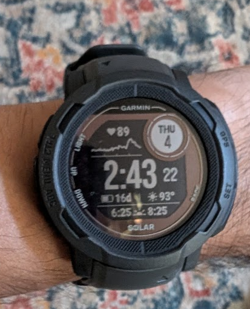
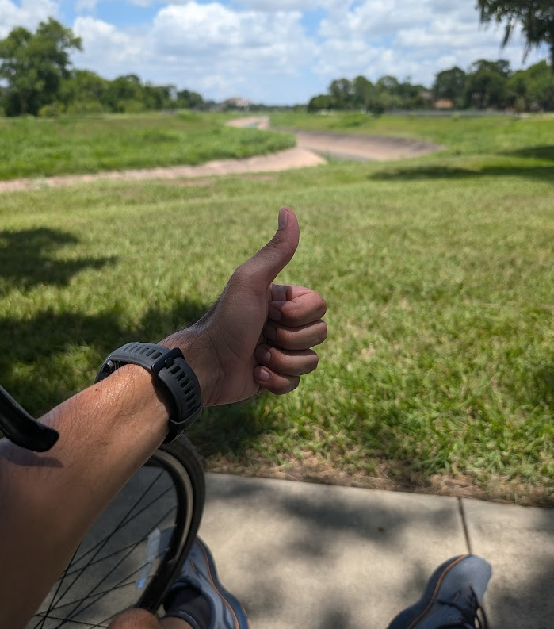

### I'm not getting any younger 😁

Two years ago, back pain became a constant companion. 
Forget work and leisure activities – just getting through the day was a battle. 
Doctors offered little relief, and exercise, while suggested, was only mentioned because I brought it up.

Then, a vacation miracle! While in vacation with my family in Puerto Vallarta, the pain started to fade. 
I had been spending a lot of time in the water. 
Could swimming be the answer? 
Soon after returning to home to Houston I signed up for the YMCA and committed to a 5am swimming routine before starting work around 6am. 

### Recovery

Fast forward 6 months and the pain is 100% manageable. 
Increadible! I had always been a fairly active person. 
I played a lot of tennis in my life but an unfortunate illness (which probably contributed to my back pain) ended my prospect of ever playing in college at around the age of 16. 
Then school became my focus and before I knew it, I was married with kids and a full time job. 
It goes without saying that exercise was not the focus of my daily routine. 

I highly suspect this was part of the problem. 
In any case, I was super excited to have dodged the bullet of chronic lower back pain at least for the time being. 
Undoubtibly, this woke me up and realized I need to stay healthy for a longer period of life, not just to be happy but to provide for my family. 

### Enter the Wearable Tech

Fast forward to this summer. I've always resisted adding more gadgets to my life, especially those nagging notification machines (phones, social media).  But my wife's new Garmin watch, with its focus on fitness and the ability to silence notifications, piqued my curiosity.  It could track my swims, runs, cycles, walks, and even sleep – all the activities I enjoy. 
She let me test it just to see how well it would measure my swims.
It is surpringly accurate! 

Sold!  Borrowing her watch to test the swim tracking feature sealed the deal.  Suddenly, something manual became beautifully automated.  
I upgraded to a Garmin Instinct 2 Solar and haven't looked back. 
Setting a goal to run a 5k under 25 minutes, I can now create a training plan and monitor my progress, preventing overexertion.

## From Personal Progress to AI Project

This newfound world of fitness data has sparked a side project for the rest of the summer: an AI coach prototype. 
The idea? Record my running form and link it to the data my Garmin provides.  The challenge is figuring out how to tie it all together and use natural language to provide realistic feedback on correcting my form.

Stay Tuned!

Over the summer, I'll be documenting the development of this AI coach prototype.  Follow along to see if I can turn this data into a helpful training companion (and maybe help others improve their form too!).